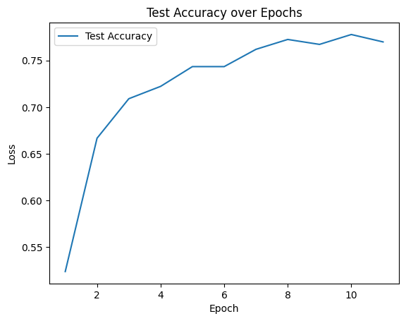

# Guitar Chord Recognition in Major C  
## support chords  
- C
- Dm
- Em
- F
- G
- Am

## Train  

### data preprocess  
- extract the chroma feature of the audio and resmaple it to [224,224]

### model
- use the pretrained Resnet to extract the feature of the audio
- freeze the Resnet and train the last layer  
- use the feature to predict the chord
- train 10 epochs  

### preformance 



- recall & precision ...  
  

## Use

```shell
git clone https://github.com/W1412X/Guitar-Chord-Audio-Recognition.git
cd Guitar-Chord-Audio-Recognition
cd exmaple
python CChordRec.py  
```


## More 
- maybe can try other feature extract technique such as mfcc